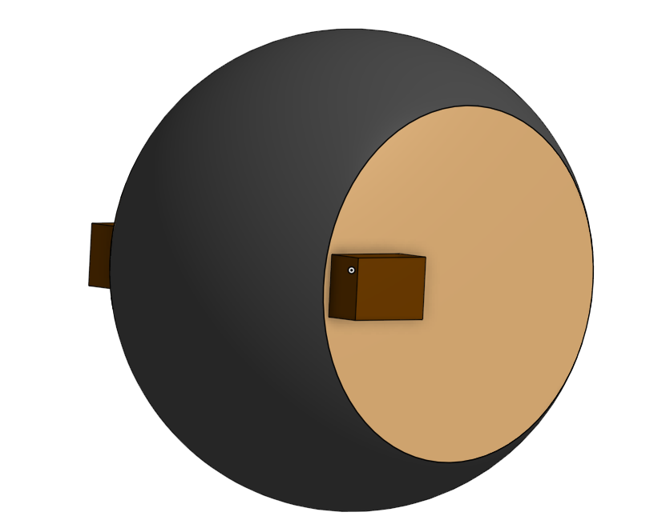
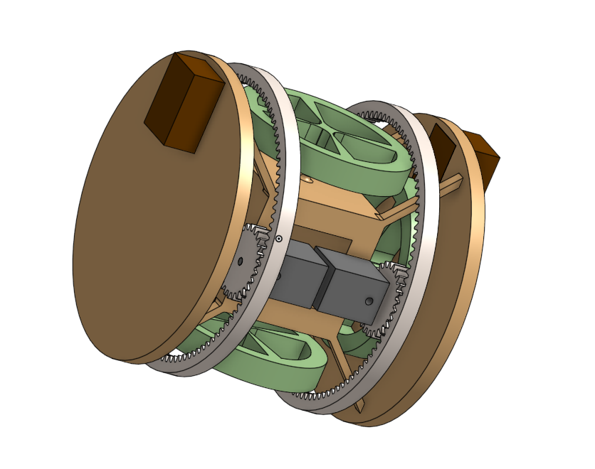

# Spherical Robot Simulation

This repository collects the Gazebo/ROS 2 assets for a spherical robot inspired by the RT‑G concept: an inner frame that stays level while an outer shell rolls to move the platform.  

The long‑term goal is to make the robot fully autonomous, using onboard sensing and control to aim the shell and maintain balance.

## What’s Included
- `gz_models/spherical_robot`: Gazebo model with the rigid frame, four reaction wheels, geared drive motors, compliant outer shell, IMU, and a forward stereo RGB camera pair.
- `spherical_robot_control`: ROS 2 package providing the URDF, controllers, topic bridges, and launch files to run the robot in Gazebo and interface with ROS tooling.
- `spherical_robot_pitch_control`: Experimental controllers for managing shell pitch/attitude while the inner frame remains stable.

Use `ros2 launch spherical_robot_control spherical_robot_sim.launch.py` to start the Gazebo simulation and control interfaces from ROS 2.
Use `ros2 launch spherical_robot_pitch_control pitch_control.launch.py` to start the pitch stabilizer.

## Robot
- The robot's CAD is created using ONSHAPE, the link to the assembly is : https://cad.onshape.com/documents/8292e6d600ced3c2465d3841/w/70278e14ae86b4fb3ec7bf72/e/6feb0eee0dd640eee4462cd0?renderMode=0&uiState=68ee60185378cb0dcc93bb2e 
- onshape-to-robot is used to create the sdf file of the robot. GREAT TOOL BTW
